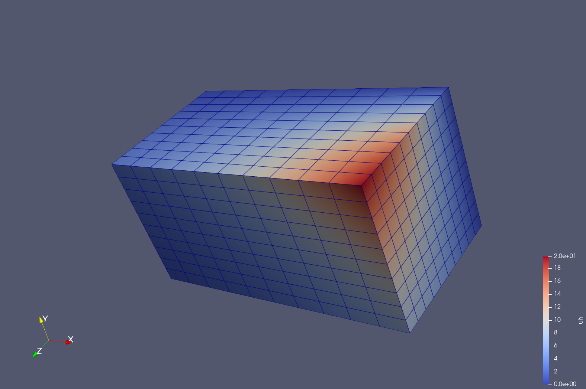

PDE to Gridap
======

Julia code to obtain weak form (using [Gridap.jl](https://github.com/gridap)) for the Poisson equation (defined using [ModelingToolkit.jl](https://github.com/SciML/ModelingToolkit.jl) and [SymbolicUtils.jl](https://github.com/JuliaSymbolics/SymbolicUtils.jl), *for a diagonal diffusion tensor*. Run `example.jl` for an example problem.

The method is based on the `@rules` macro from the `SymbolicUtils.jl` package


```Julia
isDiff = T -> T isa Differential

rule1 = @rule (~x::isDiff)((~~w)) => ((~~w))*(~x); # Integration by parts @rule
# To get coefficients
rule2=@rule (~~b)*(~x::isDiff)(~y)*(~w::isDiff)(~z)*(~~a) => [(~~b);(~~a)]
rule3=@rule (~x::isDiff)(~y)*(~~b)*(~w::isDiff)(~z)*(~~a) => [(~~a);(~~b)]
```

# Details
Setup:

``` julia
using ModelingToolkit
using Gridap
using SymbolicUtils

include("pde2gridap.jl");
```

Define the PDESystem using ModelingToolkit:

``` julia
@parameters a b  
@variables u(..)

Dx= Differential(a);  
Dy= Differential(b);

eq= Dx(a^2*Dx(u(a,b))) + Dy(b^2*Dy(u(a,b)))~ b^2*exp(a)*sin(b) - 2*a*exp(a)*sin(b) - a^2*exp(a)*sin(b) - 2*b*exp(a)*cos(b)
bcs = [u(0,b) ~ sin(b),
       u(1,b) ~ exp(1)*sin(b),
       u(a,0) ~ 0,
       u(a,1) ~ exp(a)*sin(1)]

domains = [a ∈ IntervalDomain(0.0,1.0),
           b ∈ IntervalDomain(0.0,1.0)]

pdesys = PDESystem(eq,bcs,domains,[a,b],[u(a,b)])

```

Construct problem using `FEMProblem`
``` julia
prob = sym2gridap.FEMProblem(pdesys,(50,50)) #(50,50) partition
```

Solve using FEMProblem
```julia
uh,Ω,operator = sym2gridap.FEMSolve(prob)
writevtk(Ω,"res2d",cellfields=["uh"=>uh]) # Visualize using gridap
```

The function can also be used to solve 3D problems

``` julia
Dx=Differential(x)
Dy=Differential(y)
Dz=Differential(z)
eq=Dx(Dx(u(x,y,z))) + Dy(Dy(u(x,y,z))) + Dz(Dz(u(x,y,z))) ~ 0;

#usol = exp(x+y)*sin(sqrt(2)*z)
bcs = [u(0,y,z) ~ exp(y)*sin(sqrt(2)*z),
       u(2,y,z) ~ exp(y+2)*sin(sqrt(2)*z),
       u(x,0,z) ~ exp(x)*sin(sqrt(2)*z),
       u(x,1,z) ~ exp(x+1)*sin(sqrt(2)*z),
       u(x,y,0) ~ 0,
       u(x,y,1) ~ exp(x+y)*sin(sqrt(2))];

domains = [x ∈ IntervalDomain(0.0,2.0),
           y ∈ IntervalDomain(0.0,1.0),
           z ∈ IntervalDomain(0.0,1.0)]
```

and solve using

``` julia
prob = sym2gridap.FEMProblem(pdesys,(10,10,10)); # (10,10,10) partition
uh,Ω,operator = sym2gridap.FEMSolve(prob)
writevtk(Ω,"res3d",cellfields=["uh"=>uh])
```

#### Output

 | 
-- | --
